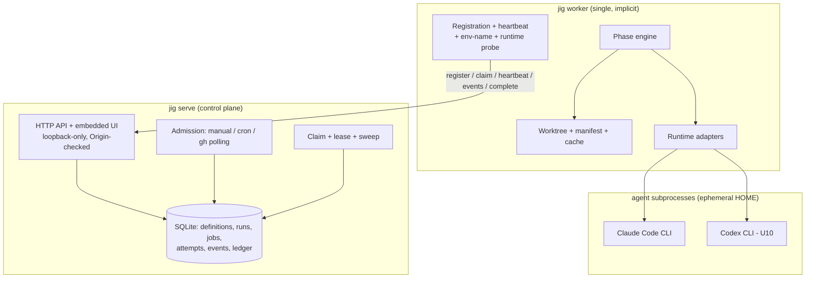
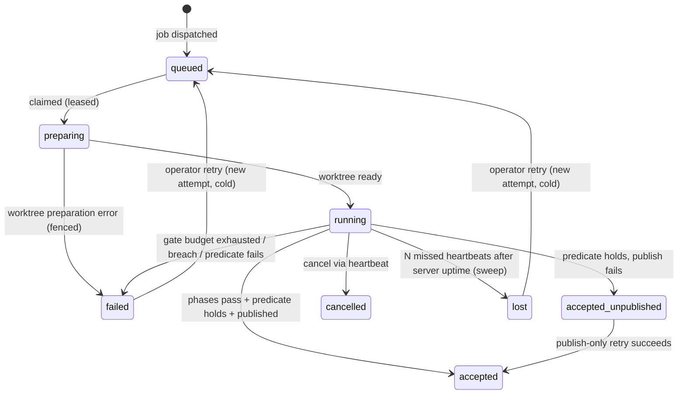
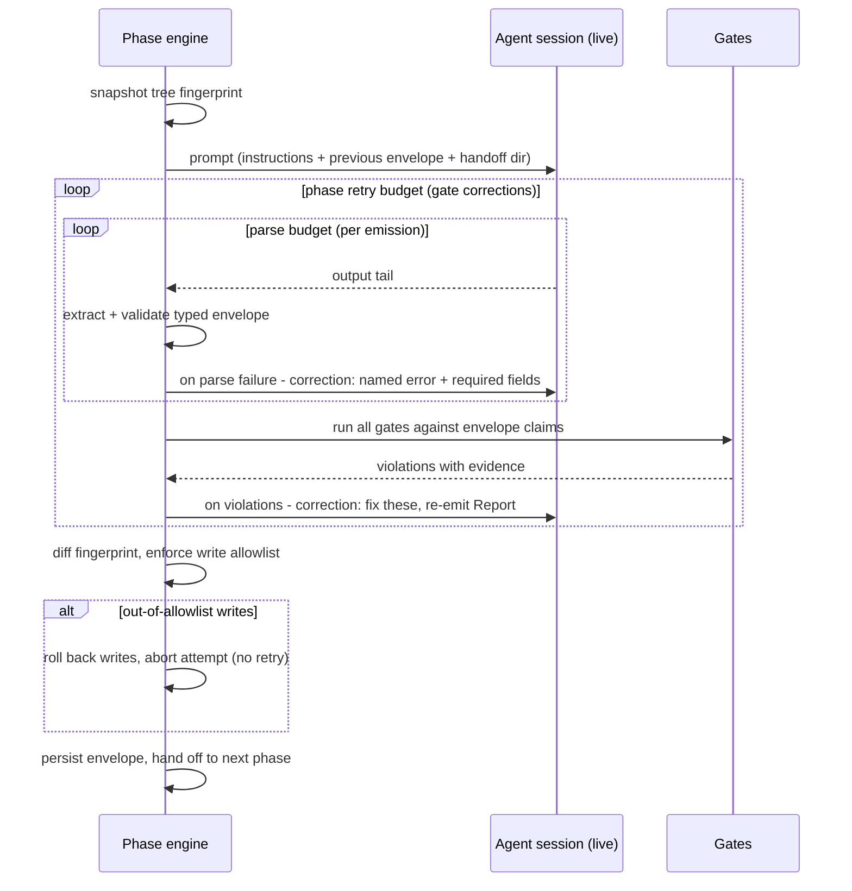

# feat: Build jig, a local-first software factory

**Target repo:** `StructuPath/jig` (this repo). Reference codebases are cited as `factory:<path>` (Victor's Go control plane, local checkout at `~/factory`) and `sssf:<path>` (disler/super-simple-software-factory, `example` branch). Neither parent is modified; both are read-only pattern sources.

---

## Summary

Build jig from scratch: a single Go binary that runs repeatable, phased coding-agent workflows against Git repositories. It combines factory's durable coordination machinery (definitions → runs → jobs → attempts, leases, idempotent claims, fail-closed worktree hygiene, admission triggers, embedded UI) with SSSF's execution model (agent and code phases, claim-verifying gates, typed envelopes, live-session repair loops, per-role rosters, event-level tracing). Local-first: loopback HTTP, one trusted operator, SQLite. Delivery is GitHub-coupled in v1 (publish means branch + PR via `gh`).

## Problem Frame

Both parents solve half the problem. factory reliably schedules agent jobs across repos but treats a job as one opaque prompt — no phases, no acceptance criteria, no intra-run structure, so "done" means "the agent stopped talking." SSSF gives one run deterministic structure — code owns sequencing, agents are bounded nodes, gates define done — but has no durability, no fleet, no concurrency (two ADWs on one repo corrupt each other's write attribution), no triggers, and inherits the whole operator environment into every agent subprocess. jig is the product both were pointing at: factory's control plane wrapped around SSSF's execution contract, greenfield, with the seam problems between the two models resolved by design rather than discovered in production.

---

## Requirements

**Definitions and runs**

- R1. A Job Definition describes a phased workflow: an ordered chain of phases (`agent` or `code`) with optional declared repair edges, a per-role roster (model, system/user prompts, tool allowlist, write allowlist, env allowlist), gates with retry budgets, and an acceptance predicate composed of named checks. Definitions validate at save time: acyclic chain with bounded declared loops, every owner role defined, every gate and predicate check resolvable against the built-in registry, prompt content present.
- R2. Invoking a definition creates a Run that freezes everything by value — instructions, prompts, roster, gate configuration, parameters, target set — plus a base commit SHA per target resolved at admission.
- R3. A Run fans out into independent Jobs, one per target repository. Job failure, retry, and cancellation are per-job; a Run is never replayed as a whole.

**Coordination and reliability**

- R4. Claiming is one idempotent transaction: request-id plus lease-token-digest replay semantics, in-transaction eligibility (worker liveness, capacity, required env-var names advertised), FIFO ordering with skip-over for jobs whose repository is at its retained-worktree cap.
- R5. Leases renew via heartbeat; the heartbeat response carries cancellation. A heartbeat may renew an expired-but-unswept lease iff the attempt has not transitioned and no successor attempt exists (one fenced transaction), so whole-machine sleep is benign. Sweep marks an attempt `lost` only after N consecutive missed heartbeats measured after server uptime resumes; lease math tolerates wall-clock jumps. Recovery is explicit operator retry — always a cold restart from phase 1 in a fresh worktree with fresh agent sessions.
- R6. Every attempt-state write and every publish step validates the lease token (fencing). Replayed terminal completions return the stored outcome.

**Phase execution**

- R7. Agent phases run the agent CLI as a supervised subprocess with create-or-continue session identity. Envelope parse failures re-prompt the same live session with a per-emission parse budget; gate violations re-prompt under the phase retry budget, and every corrected emission re-enters parsing. Every invalid attempt persists to the trace. When a runtime cannot resume sessions, corrections replay a bounded transcript digest into a fresh session and definition validation warns that correction cost is elevated for that role.
- R8. Typed JSON envelopes are the only inter-phase contract. Code phases wrap their results in adapter envelopes so a failing test suite enters the repair loop through the same door as a failing agent report.
- R9. Gates verify envelope claims after the phase completes and record `{item, ok, note}` evidence — a green gate says what it checked. The built-in registry ships `artifacts_exist`, `files_non_empty`, `diff_matches_claims`, `verdict_consistent`, and `tests_pass(command)`; repo-specific verification beyond it is a code phase.
- R10. Write boundaries are enforced by tree-fingerprint diff around each agent phase: out-of-allowlist writes roll back, then the attempt aborts. Breach is never retried.
- R11. Every phase has a wall-clock timeout and a no-output watchdog, and every attempt has a wall-clock ceiling. A crashed or hung agent phase consumes one phase retry, rolls the worktree back to the pre-phase snapshot, and restarts with a fresh session.
- R12. A Job is `accepted` only when all phases passed AND the acceptance predicate holds (worker-evaluated, with evidence) AND publish completed with remote proof. A Job whose phases and predicate pass but whose publish fails is `accepted_unpublished`. Run state aggregates: `accepted` iff all jobs accepted; `failed` iff all jobs failed; otherwise `mixed`.

**Admission and publish**

- R13. Admission — manual, cron schedule, GitHub polling trigger — is structurally idempotent: UNIQUE request keys, commit-occurrence-then-dispatch. A schedule firing while its prior run is active skips and surfaces a counter. On wake after downtime, the single stored overdue instant is admitted; all other missed fires are skipped, never caught up.
- R14. Publish uses attempt-scoped branches (`jig/<job-id>/<attempt-n>`), idempotent push, find-or-create PR by head ref, and remote-ref proof of publish. `accepted_unpublished` is a distinct job state with a publish-only retry action.

**Observability and hygiene**

- R15. Every phase, tool-call, gate, and envelope event dual-writes attempt-local JSONL and streams to the control plane with a per-attempt monotonic sequence number; the UI polls by sequence cursor and renders live swim lanes per job with one lane per attempt. Values matching the definition's sensitive env names are redacted before persistence.
- R16. The retained-worktree ledger lives control-plane-side, reconciled bidirectionally at worker start, with an operator release action gated on inspection confirmation.
- R17. Agent subprocesses receive an allowlisted environment per role — never the operator's full environment. Workers advertise available env-var *names* (never values) at registration; a job whose definition requires an unadvertised name fails at claim eligibility, not N phases deep.

**Security posture**

- R20. The server binds `127.0.0.1` by default and refuses non-loopback binds without an explicit opt-in flag; state-changing HTTP routes reject requests whose Origin is not the server's own (or that lack the embedded UI's per-process token).
- R21. Agent subprocesses run with a jig-managed ephemeral `HOME`/XDG containing no operator credential files; operator dotfiles (`~/.gitconfig`, `~/.ssh`, `~/.config/gh`) are unreachable, and anything written there dies with the attempt. Network egress is not restricted in v1 (accepted residual risk, per-role Bash access is the control).

**Packaging**

- R18. One `jig` binary (`serve`, `worker`, `run`, `def` subcommands), pure-Go SQLite, embedded committed UI. Operators never need Node.
- R19. Repo hygiene from day one: Justfile as the command surface, mechanical package-boundary check, SHA-pinned CI on Linux and macOS, reproducible cross-compiled binaries for the platforms in use.

---

## Key Technical Decisions

- **KTD1 — One Go module, one binary, enforced internal boundaries.** `jig serve`, `jig worker`, `jig run` are subcommands of one binary; `internal/worker` may never import `internal/controlplane` (mechanically checked, as `factory:Justfile:57-58` does). One binary suits local-first; the boundary keeps a later split cheap.
- **KTD2 — Workflows are declarative data with a generalized repair construct.** A definition is a YAML chain of phases. Any phase may declare a repair edge — `on_fail: {run: <phase>, then: rerun-self, budget: N}` — where failure is nonzero exit for code phases and a declared envelope predicate (e.g., `approved == false`) for agent phases; a phase may carry an `if: <envelope-field>` guard; loop exhaustion is `fail-job` (default) or `proceed` per edge. This expresses all four stock workflows including simple-sdlc's agent→agent review/revise loop and conditional retest. Save-time validation rejects anything non-linear beyond declared bounded loops — the antidote to SSSF's observed drift bug (its `example` branch crashes at the test phase because ADW scripts call renamed quality functions; contracts held only by convention rot). The control plane must freeze, fan out, and diff definitions — scripts resist all three.
- **KTD3 — SQLite via pure-Go driver, ported as transaction+constraint pairs.** factory's reliability comes from pairing schema constraints (partial unique index for one-active-attempt, UNIQUE request keys) with single-transaction state changes (`factory:internal/controlplane/state.go:14-188`). Port the pairs, never one half.
- **KTD4 — Runtime adapters with capability flags, probed at worker start.** Claude Code and Codex differ in session resume semantics, stream shape, and cost reporting. One `Runtime` interface with per-CLI capability flags (can-resume, resume-key semantics, reports-cost) rather than a lowest-common-denominator abstraction. A worker-start probe records CLI version and capabilities into registration; the CLI version is recorded per attempt. v1 ships the Claude Code adapter; Codex follows once the loop is proven (U10).
- **KTD5 — Agent sessions are attempt-scoped by declaration.** Warm correction exists only inside a live attempt; CLI session state is worker-local, so it does not survive a new worktree. Operator retry is therefore always cold. Expired-but-unswept leases are renewable (R5) so co-sleep of server and worker does not kill intact work. Resume-from-phase is a deferred checkpointing feature, not a retry flag.
- **KTD6 — Fenced, idempotent publish.** Lease-token validation on every publish step; branch names attempt-scoped; PR creation find-or-create by head ref; proof of publish verifies the remote ref. This closes the zombie-attempt race (laptop sleeps mid-phase, sweep marks lost, retry starts, zombie wakes and pushes).
- **KTD7 — GitHub admission by `gh` polling, not webhooks.** Webhooks cannot reach a loopback-only server. Polling with fixed-argument `gh` invocations is factory's battle-tested path (`factory:internal/controlplane/automation_runtime.go`); dedup keys derive from event content (repo, trigger kind, issue/PR number or head SHA).
- **KTD8 — Event transport is worker→server HTTP ingestion with local buffer and per-attempt sequencing.** Attempt-local JSONL is the raw record; the worker streams bounded event batches carrying a monotonic per-attempt `seq`, and on ingestion failure buffers and replays rather than blocking the phase. `UNIQUE(attempt_id, seq)` with insert-or-ignore makes replay idempotent; UI cursors ride `seq`, not rowid. Server SQLite is the single UI source.
- **KTD9 — Base SHA pinned at admission.** Retries days later run against the pinned SHA; fan-out sees one point in time; "re-admit at head" is the explicit escape hatch. A frozen snapshot that resolves refs lazily is not frozen.
- **KTD10 — Per-role environment allowlists, validated against worker-advertised names.** SSSF passes the operator's entire environment (every API key) to every agent and everything the agent's bash spawns. jig composes each subprocess environment from a per-role allowlist; workers advertise available names at registration and claim eligibility enforces them (R17). Save-time validation checks schema shape only — presence is a worker property, not a server property.
- **KTD11 — Ephemeral agent `$HOME`.** The env allowlist alone cannot block file-based credentials (`~/.config/gh`, `~/.ssh`) or dotfile persistence (`~/.gitconfig` hooks), and GitHub issue text feeding prompts makes indirect prompt injection a live path. Each attempt's agent subprocesses get a jig-created `HOME`/XDG directory seeded with only what the runtime needs, destroyed with the attempt (R21). The agent CLI's own auth is provisioned into that HOME explicitly per role.
- **KTD12 — Single implicit worker in v1.** `jig worker` is one local worker: registration is trivial, eligibility is liveness plus capacity slots plus advertised env names, and multi-worker routing/fleet scheduling is deferred. The worker→server HTTP seam and schema keep the pool model reintroducible without migration.

---

## High-Level Technical Design

### Component topology



Workers initiate every connection; the server never dials a worker. Cancellation rides the heartbeat response. `jig run` embeds engine + an in-process server for direct serverless runs (U11).

### Attempt lifecycle



Every transition out of `preparing`/`running` validates the lease token. A prep failure whose pinned SHA is no longer fetchable names "re-admit at head" in its diagnostic. `cancelled` and `failed` are distinct because their retry semantics differ; an envelope-less phase death (kill, crash) gets its own terminal trace event.

### Agent phase execution



Every corrected emission re-enters parsing with a fresh per-emission parse budget; the worst-case send count (`gate_budget × parse_budget`) is a named constant in the limits table, and the per-attempt wall-clock ceiling bounds total cost. Corrections go to the *same live session* — one message, not a cold start; a `can-resume=false` runtime degrades to transcript-digest replay (R7). A subprocess crash or watchdog fire breaks out of this diagram entirely: roll back to the pre-phase snapshot, consume one phase retry, fresh session.

---

## Output Structure

```text
jig/
├── cmd/jig/                  # single binary: serve, worker, run, def subcommands
├── internal/
│   ├── controlplane/         # store, claim, admission, publish ledger, worktree ledger, HTTP
│   ├── worker/               # registration, claiming, worktrees, manifests, cache, publish
│   ├── engine/               # phase loop, gates, envelopes, repair, write-boundary, ephemeral HOME
│   ├── runtime/              # Runtime interface + claudecode/ (+ codex/ in U10)
│   └── protocol/             # shared types, limits table, definition schema, prompt composition
├── migrations/               # embedded numbered .sql + ledger
├── web/                      # React UI, committed dist/ embedded via go:embed
├── examples/definitions/     # stock library: smoke, scout, plan-build-test, simple-sdlc
├── docs/plans/
├── Justfile
└── .github/workflows/
```

The tree is a scope declaration; per-unit **Files** lists are authoritative.

---

## Scope Boundaries

### Deferred to Follow-Up Work

- Resume-from-phase checkpointing (per-phase attempt refs + control-plane envelope persistence) — designed against, not built (KTD5).
- Arbitrary phase graphs and parallel phases beyond declared bounded repair loops (KTD2 rejects at save in v1).
- Multi-worker fleet: registration-based routing, capability scheduling, per-worker capacity markets (KTD12 collapses v1 to one implicit worker behind the same seam).
- Phase-level parallelism within one job; a global concurrent-agent-sessions cap beyond per-worker capacity.
- Local publish mode (in-repo branch as proof of publish, no GitHub) — v1 delivery is GitHub-coupled.
- Network egress restriction for agent subprocesses (R21 accepts the residual risk in v1).
- Overview metrics dashboard (throughput/cycle-time panels) — the events table retains everything needed to add it later.
- Double-build reproducibility verification and tag-provenance release checks — supply-chain rigor deferred until jig has consumers beyond its builder.
- GitHub App / webhook admission; provider-actions outbox with capability policy (from factory's target design — unimplemented there too).
- Runner/VM/Kubernetes capacity; anything beyond one or more local worker processes.
- Multi-user auth, TLS, non-loopback listeners.
- SSSF-style stamping installer (jig is a binary, not stamped files); pi runtime adapter.

### Outside this product's identity

Carried from factory's vision: human project management, chat, inboxes, agent personas/squads, a generic workflow builder, business-process automation. GitHub remains the source of issues, PRs, and repository state.

---

## Implementation Units

### Milestone 1 — a real accepted run on one machine

Exit gate: three consecutive accepted runs of a two-phase fixture definition via `jig run` with the real Claude Code CLI, including one forced parse-correction and one forced gate-correction. Repair-budget burn rate on these runs decides whether Milestone 2 proceeds or adapter tuning continues.

### U1. Scaffold, domain schema, and protocol

- **Goal:** A building repo with the full persistent model and shared types, before any behavior.
- **Requirements:** R1, R2, R3, R18, R19
- **Dependencies:** none
- **Files:** `go.mod` (`github.com/StructuPath/jig`), `cmd/jig/main.go`, `internal/protocol/types.go`, `internal/protocol/limits.go`, `internal/protocol/definition.go`, `migrations/001_core.sql`, `migrations/embed.go`, `Justfile`, `.github/workflows/ci.yml`, `internal/protocol/definition_test.go`, `internal/controlplane/migrate_test.go`
- **Approach:** Tables: `definitions`, `runs` (frozen snapshot by value, per-target pinned SHAs), `jobs`, `attempts` (partial unique index: one active attempt per job), `claim_requests`, `events` (per-attempt monotonic `seq`, `UNIQUE(attempt_id, seq)`), `envelopes` (with `valid` and `attempt` columns), `gate_results`, `workers` (advertised env names, runtime capabilities/version), `retained_worktrees` (control-plane ledger, R16), `publish_records`, `schema_migrations`. Every limit is a named constant in `internal/protocol/limits.go`, including the worst-case send count and per-attempt wall-clock ceiling (R11). Definition schema (YAML) per R1 and KTD2: chain, repair edges with budgets and exhaustion policy, `if:` guards, roster with env allowlists, gates and predicate checks resolved against the built-in registry names (R9).
- **Patterns to follow:** `factory:migrations/001_controlplane.sql` (constraint style, partial indexes), `factory:internal/protocol/types.go` (limits-as-constants), `sssf:adws/adw_modules/data_types.py` (envelope field shapes, GateReport).
- **Test scenarios:**
  - Migrating an empty database applies all migrations and records each in the ledger; re-running is a no-op.
  - A definition with an undefined owner role, an unresolvable gate or predicate-check name, an unbounded repair loop, or a repair edge forming a cycle beyond its declared budget fails validation with a message naming the offending element.
  - The simple-sdlc shape validates: an agent-phase repair edge keyed on `approved == false` targeting the builder with `then: rerun-self`, a `retest` phase guarded by `if: revised`, and a `proceed`-on-exhaustion review loop.
  - Inserting a second active attempt for one job violates the partial unique index; inserting a duplicate `(attempt_id, seq)` event is ignored.
- **Verification:** `just check` green on a fresh clone with no Node installed; schema matches the model in this plan.

### U2. Control plane core: claim, lease, sweep, retry

- **Goal:** The coordination heart — jobs queue, the worker claims, leases fence, expiry sweeps, retries are cold, sleep is benign.
- **Requirements:** R4, R5, R6, R20
- **Dependencies:** U1
- **Files:** `internal/controlplane/store.go`, `internal/controlplane/claim.go`, `internal/controlplane/sweep.go`, `internal/controlplane/http.go`, `internal/controlplane/server.go`, `internal/controlplane/store_test.go`, `internal/controlplane/claim_test.go`
- **Approach:** Port factory's claim transaction shape: request-id + lease-digest idempotency (tokens stored only as SHA-256), in-transaction eligibility (liveness, capacity, required env names ⊆ advertised names per KTD10/KTD12), FIFO with skip-over for repos at their retained-worktree cap. Heartbeat renews an expired-but-unswept lease iff the attempt has not transitioned and no successor exists, in one fenced transaction (R5); sweep requires N consecutive missed heartbeats counted after server uptime resumes, with monotonic-aware lease math. Retry re-queues a new cold attempt against the run's pinned SHA. All attempt-state writes take the lease token. Server binds `127.0.0.1` by default, refuses non-loopback bind without an explicit flag, and validates Origin (or the UI's per-process token) on every state-changing route (R20).
- **Patterns to follow:** `factory:internal/controlplane/state.go:14-188` (the claim transaction — the single most valuable artifact in either parent), behavioral-sentence test naming per `factory:internal/controlplane/store_test.go`.
- **Test scenarios:**
  - Replaying a claim with the same request-id and token returns the identical answer; a different token returns a conflict.
  - A worker past its liveness window, at capacity, or missing a required env name claims nothing even with queued work.
  - Covers R4: with jobs queued for repos A (at retained cap) and B (clear), a claim returns B's job.
  - Covers R5: after a simulated 8-hour suspend of server and worker together, the worker's first heartbeat renews the expired lease and the attempt continues; the same heartbeat is rejected when a successor attempt exists.
  - A lease expiring with N missed heartbeats sweeps to `lost`; a completion arriving afterward with the stale token is rejected.
  - Terminal completion replayed with the original token returns the stored outcome unchanged.
  - Retry of a failed job creates attempt N+1 targeting the run's pinned base SHA even after the target repo's head moved.
  - Covers R20: a state-changing request carrying a foreign Origin is rejected; binding to a non-loopback address without the opt-in flag refuses to start.
- **Verification:** race-detector pass on claim/heartbeat/sweep interleaving tests.

### U3. Worker host layer: registration, worktrees, manifests

- **Goal:** A single implicit worker that registers with its capabilities, claims, materializes an isolated worktree per attempt, and never deletes work it cannot prove is published.
- **Requirements:** R5, R16, R17
- **Dependencies:** U2
- **Files:** `internal/worker/registration.go`, `internal/worker/claiming.go`, `internal/worker/repocache.go`, `internal/worker/worktree.go`, `internal/worker/manifest.go`, `internal/worker/reconcile.go`, `internal/controlplane/worktree_ledger.go`, `internal/worker/worker_integration_test.go`
- **Approach:** Registration carries runtime capabilities and CLI version (from the KTD4 probe), capacity, available env-var names (R17), cached repos, retained worktrees. Bounded on-demand repo cache (managed identities only — never clone a URL from a ticket). Worktree per attempt at the pinned SHA on branch `jig/<job-id>/<attempt-n>`. Per-attempt manifest plus disposal journal; at start, reconcile disk↔ledger both directions (orphan worktree with no ledger row, ledger row with no disk) and reap stale capacity. Cleanup fails closed: retain on uncertainty, delete only after remote-ref proof. Operator release action flows through the control-plane ledger with an inspection confirmation.
- **Patterns to follow:** `factory:internal/worker/manifest.go`, `factory:internal/worker/reconcile.go` (prove-published-before-delete), `factory:internal/worker/git.go` (origin revalidation around fetch).
- **Test scenarios:**
  - Two concurrent attempts on one repository get disjoint worktrees and branches from one shared cache entry.
  - A worktree with unpublished commits survives cleanup and appears in the ledger with a release action; releasing it requires the confirmation flag.
  - Worker restart with an orphan on-disk worktree (no ledger row) reports it rather than deleting it; a ledger row with no disk marks the ledger entry lost.
  - Covers R16: a repo at its retained cap admits no new attempt worktrees until a release.
  - Registration advertises the env-name set; removing a variable from the worker's environment and re-registering shrinks the advertised set.
- **Verification:** integration test against real git repos and a real server process, in the style of `factory:internal/worker/worker_integration_test.go`.

### U4. Phase engine: the SSSF core, in Go

- **Goal:** Execute a frozen definition's chain inside an attempt: agent phases with live-session repair, declared repair edges, code phases with adapter envelopes, gates with evidence, write-boundary enforcement, ephemeral HOME, acceptance.
- **Requirements:** R7, R8, R9, R10, R11, R12 (evaluation half), R17, R21
- **Dependencies:** U3
- **Files:** `internal/engine/phase.go`, `internal/engine/envelope.go`, `internal/engine/gates.go`, `internal/engine/repair.go`, `internal/engine/boundary.go`, `internal/engine/homedir.go`, `internal/engine/accept.go`, `internal/runtime/runtime.go`, `internal/runtime/claudecode/adapter.go`, `internal/engine/phase_test.go`, `internal/engine/boundary_test.go`, `internal/runtime/claudecode/adapter_test.go`
- **Approach:** Phase status defaults to failed; success is earned. The one v1 runtime adapter (Claude Code, per KTD4) owns subprocess supervision (process group with anchor, stdin prompt delivery, bounded output streaming, session create-or-continue — `factory:internal/worker/supervisor.go` mechanics under the `Runtime` interface); a worker-start probe records version and capabilities. Envelope extraction tolerates fences/prose; parse failure re-prompts the live session naming the error and required fields, with a per-emission parse budget; every gate-corrected emission re-enters parsing (R7); invalid attempts persist. Gates are the built-in Go claim-verifier registry (R9) returning `{item, ok, note}` checks; violations re-prompt the live session. Repair edges per KTD2: code-phase `on_fail` routes the adapter envelope to the named agent phase then re-runs the failed phase; agent-phase `on_fail` keys on the declared envelope predicate; `if:` guards skip phases; exhaustion honors the edge's `fail-job`/`proceed` policy. Write boundary: fingerprint snapshot before, diff after (deletions and reverts count), roll back out-of-allowlist paths, then abort. Each attempt's subprocesses get a jig-created ephemeral HOME seeded per role (KTD11), with env composed from the role's allowlist (KTD10). Watchdog: per-phase wall clock plus no-output timer plus per-attempt ceiling; crash consumes one phase retry after rollback to the pre-phase snapshot with a fresh session. Handoff dir lives outside the worktree so scratch notes can never ship in the publish diff. Acceptance predicate (declared named checks) evaluates worker-side with evidence.
- **Execution note:** Build the envelope/gate/repair loop test-first against a scripted fake Runtime before touching the real CLI — the loop's correctness is the product. The fake must support "write these files, then emit this output" steps so write-boundary scenarios are expressible.
- **Patterns to follow:** `sssf:adws/adw_modules/agents.py:78-216` (the call pipeline order: parse loop nested in correction loop → gates → enforcement → persist), `sssf:adws/adw_modules/permissions.py` (fingerprint diff, reverts-count-as-writes, breach-aborts), `sssf:adws/adw_modules/gates.py` (claim-verification philosophy), `factory:internal/worker/supervisor.go` (process-group ownership, bounded buffers).
- **Test scenarios:**
  - An agent returning prose-wrapped valid JSON parses; one returning invalid JSON past the per-emission budget persists every invalid envelope and fails the phase; a gate-corrected emission that is malformed gets its own fresh parse budget.
  - A gate violation triggers a correction into the same session id; the corrected envelope re-runs all gates, not just the failed one.
  - An envelope with `status: fail` fails the phase even though it parsed and gated clean.
  - A code phase exiting nonzero routes its adapter envelope through its declared repair edge to the named agent phase, then re-runs; edge-budget exhaustion honors `fail-job` vs `proceed` as declared.
  - A simple-sdlc-shaped chain executes end-to-end on the scripted runtime: review rejection dispatches the builder and re-reviews; `if: revised` triggers retest exactly when a revision occurred.
  - Covers R10: an agent writing outside its allowlist (including reverting a pre-existing dirty file) is rolled back and the attempt aborts without consuming a retry.
  - Covers R21: an agent writing to `$HOME/.gitconfig` writes into the ephemeral HOME; the file is destroyed with the attempt and the operator's real dotfiles are untouched; the subprocess env contains only the role's allowlisted variables.
  - Covers R11: a runtime that emits nothing past the no-output watchdog is killed by process group; the phase re-enters once with a clean worktree and fresh session, and the trace shows both phase attempts; an attempt exceeding its wall-clock ceiling terminates with its own terminal event.
  - Covers R12: all phases pass but the acceptance predicate fails → job `failed` with the predicate's evidence, exit distinct from a phase failure.
  - With a fake runtime flagged `can-resume=false`, corrections arrive as transcript-digest replays in fresh sessions and the trace marks the elevated-cost path.
- **Verification:** a scripted-runtime end-to-end run of a three-phase chain (agent → code-with-repair-edge → agent) completes with the exact expected event sequence; then a live smoke against the real Claude Code CLI.

### U11. Direct run harness: `jig run`

- **Goal:** The serverless day-one loop — load a definition file, run the engine in-process against a repo, print the trace path. This is the Milestone 1 exit-gate harness and the primary dogfooding surface.
- **Requirements:** R1, R18
- **Dependencies:** U1, U4
- **Files:** `cmd/jig/run.go`, `internal/controlplane/embedded.go`, `cmd/jig/run_test.go`, `examples/definitions/smoke.yaml`
- **Approach:** `jig run --def <file> <repo-path> "<prompt>"` validates the definition, freezes an in-process run against the local repo (pinned at its current HEAD), executes the phase chain via the engine with the embedded store, and prints the attempt's trace location and outcome. No standing server, no publish (terminal state `accepted_unpublished` semantics do not apply — direct runs end at predicate evaluation with an explicit no-publish marker). The smoke definition (one read-only agent phase) ships here, not U9: it is the install check.
- **Test scenarios:**
  - `jig run` with the smoke definition on a fixture repo and scripted runtime completes green and prints the trace path.
  - An invalid definition file fails before any subprocess spawns, naming the offending element.
  - A direct run records the same event stream shape as a server-path run (same tables, `seq`-ordered).
- **Verification:** the Milestone 1 exit gate: three consecutive accepted real-CLI runs of a two-phase fixture definition, including one forced parse-correction and one forced gate-correction.

### Milestone 2 — definitions in, changes out

Exit gate: an accepted run through the server path publishing a real branch and PR on a scratch GitHub repo.

### U5. Definitions, snapshots, manual runs, fan-out

- **Goal:** Author, validate, freeze, and invoke definitions through the control plane; fan out to jobs.
- **Requirements:** R1, R2, R3
- **Dependencies:** U2 (store), U4 (engine consumes snapshots)
- **Files:** `internal/controlplane/definitions.go`, `internal/controlplane/runs.go`, `internal/protocol/prompt.go`, `internal/controlplane/definitions_test.go`, `internal/controlplane/runs_test.go`
- **Approach:** Definitions edit in place with a generation counter; Runs snapshot by value (factory's target-design verdict: no user-facing revision library). Admission pins base SHA per target (KTD9). Prompt composition is control-plane-only, separating trusted definition instructions from bounded untrusted context, per `factory:internal/protocol/prompt.go`. Fan-out creates independent jobs; run state aggregates per R12.
- **Test scenarios:**
  - Editing a definition after a run is admitted changes nothing about that run's jobs (snapshot isolation), including gate configuration.
  - A run targeting three repos yields three jobs with three pinned SHAs; one job failing leaves siblings untouched and the run `mixed`.
  - Covers R2: retrying a job after the definition changed still executes the frozen snapshot.
- **Verification:** invoking a fixture definition through the API produces an `accepted_unpublished` run end-to-end on a fixture repo (publish lands in U7; the stock library ships in U9).

### U6. Admission triggers: schedules and GitHub polling

- **Goal:** Unattended admission with structural idempotency.
- **Requirements:** R13
- **Dependencies:** U5
- **Files:** `internal/controlplane/schedule.go`, `internal/controlplane/cron.go`, `internal/controlplane/github_poll.go`, `internal/controlplane/admission_test.go`, `internal/controlplane/cron_test.go`
- **Approach:** Hand-rolled five-field cron with IANA timezones and explicit DST semantics (`factory:internal/controlplane/schedule_cron.go` — DST overlap fires twice, nonexistent minute skips). Schedule request key = (trigger id, scheduled instant); overlap-skip with surfaced counter; wake-after-sleep admits at most the one stored overdue instant. GitHub triggers poll via fixed-argument `gh` with bounded output and per-failure diagnostic codes (KTD7); dedup on event content. Commit-occurrence-then-dispatch two-phase admission so a crash between them recovers.
- **Test scenarios:**
  - A schedule firing while its prior run is active creates no run and increments the skip counter.
  - Simulated 8-hour clock jump admits exactly one overdue instant, then the next future match (R13).
  - The same GitHub issue observed by two consecutive polls creates one occurrence and one run; a crash after occurrence-commit but before dispatch recovers to exactly one run.
  - `gh` timeout, unauthenticated, and over-limit responses each produce their distinct actionable diagnostic without creating occurrences.
- **Verification:** trigger a run from a real `gh`-visible test issue locally.

### U7. Publish pipeline

- **Goal:** Get accepted work out — fenced, idempotent, provable.
- **Requirements:** R6, R12 (publish half), R14
- **Dependencies:** U4
- **Files:** `internal/worker/publish.go`, `internal/controlplane/publish_ledger.go`, `internal/worker/publish_test.go`
- **Patterns to follow:** `factory:internal/worker/reconcile.go` for the remote-ref-proof half only; the push and PR mechanics are new code with no parent reference.
- **Approach:** Publish is a critical section: cancel is a no-op inside it. Steps each idempotent — push attempt-scoped branch (branch-exists tolerated), find-or-create PR by head ref, verify remote ref, record proof control-plane-side with the lease token validated per step. Push-succeeds-PR-fails lands in `accepted_unpublished` with a publish-only retry that re-enters at the failed step. Commit staging uses the phase engine's computed changed-paths, never `git add -A` (SSSF lesson: it once committed 15 stray `.pyc` files). The fence cannot fence GitHub itself: a zombie whose lease expires mid-publish can leave a stray attempt-scoped branch or PR — confined by branch naming, surfaced by a reconcile-time stray-branch report rather than prevented.
- **Test scenarios:**
  - Covers R14: a zombie attempt (expired lease) reaching a publish step is rejected by the fence; the successor attempt publishes its own branch cleanly; a stray branch pushed just before expiry appears in the reconcile report.
  - Re-running publish after a failure between push and PR creation creates no duplicate branch or PR.
  - Covers R14: PR creation failing after push yields `accepted_unpublished`; publish-only retry completes without re-running any phase.
  - Proof-of-publish checks the remote ref; a local reflog entry alone does not unblock cleanup.
- **Verification:** the Milestone 2 exit gate: end-to-end against a scratch GitHub repo — accepted job → branch → PR → cleanup deletes the worktree only after remote proof.

### U10. Codex runtime adapter

- **Goal:** Second runtime, added once the loop is proven against Claude Code.
- **Requirements:** R7, R18
- **Dependencies:** U4 (interface + a working reference adapter), U11 (real-run harness to tune against)
- **Files:** `internal/runtime/codex/adapter.go`, `internal/runtime/codex/adapter_test.go`
- **Approach:** Implement the `Runtime` interface for Codex CLI: stream-shape normalization, session semantics behind the capability flags (Codex sessions are id-keyed, not path-keyed), cost/token reporting differences, worker-start probe. Tune envelope compliance against the U11 harness the way Claude Code was tuned.
- **Test scenarios:**
  - The scripted U4 engine suite passes unchanged with the Codex adapter substituted (interface conformance).
  - A real-CLI smoke: a two-phase chain with one forced parse-correction completes; the trace records Codex version and capability flags.
- **Verification:** one real accepted `jig run` with a Codex-rostered definition.

### Milestone 3 — see it and operate it

### U8. Trace ingestion and UI

- **Goal:** The operator sees the queue and the inside of every run, live.
- **Requirements:** R15
- **Dependencies:** U4 (events exist), U2 (server)
- **Files:** `internal/worker/events.go`, `internal/controlplane/ingest.go`, `web/` (Vite + React app), `web/embed.go`, `internal/controlplane/ingest_test.go`, `web/src/RunDetail.test.tsx`
- **Approach:** Worker dual-writes attempt-local JSONL and streams bounded ordered batches carrying per-attempt `seq`; ingestion failure buffers and replays without blocking the phase; `UNIQUE(attempt_id, seq)` insert-or-ignore makes replay idempotent (KTD8). Redact values matching the definition's sensitive env names before persistence (R15). Event vocabulary from SSSF (`phase_start/agent_start/tool_call/handoff/gate_pass/gate_fail/log/agent_end/phase_end/error`) plus an envelope-less phase-death terminal event. Tool calls fold to one row with a real wall-clock span. UI: work queue with a queue-depth count, run/job detail with per-attempt swim lanes on a time axis, envelope and gate-evidence inspection, retained-worktrees view with the release action. No overview-metrics dashboard in v1 (deferred; the events table retains the data). Seq-cursor poll per attempt; invalid-envelope rows size-capped with the full form intact in attempt-local JSONL.
- **Patterns to follow:** `sssf:adws/adw_modules/tracer.py` (event schema, spend-vs-occupancy token accounting), `sssf:.claude/skills/sssf/apps/visualizer/server/db.ts` (readonly open, probe-and-latch optional columns), `factory:web/embed.go` (SPA fallback only for app routes, immutable caching).
- **Test scenarios:**
  - Events replayed after an ingest outage land exactly once in `seq` order; a UI cursor that advanced during the outage still renders the replayed events in order.
  - Covers R15: attempt 2 of a retried job renders as its own lane; attempt 1's history remains inspectable and the cursors never interleave.
  - A running agent shows live tool calls with durations before its envelope exists.
  - A tool-call payload containing a value from the role's sensitive env names is persisted redacted in SQLite while the JSONL raw record notes the redaction.
- **Verification:** watch a live three-phase run paint swim lanes in the browser with under a second of lag.

### U9. CLI polish, stock library, release pipeline

- **Goal:** `jig` feels finished: one command up, stock definitions that prove the model, releasable binaries.
- **Requirements:** R18, R19
- **Dependencies:** U1–U8, U10, U11 (the CLI commands integrate the full stack: serve wires U2/U6/U8, worker wires U3/U4, run and def wire U1/U5)
- **Files:** `cmd/jig/serve.go`, `cmd/jig/worker.go`, `cmd/jig/def.go`, `examples/definitions/scout.yaml`, `examples/definitions/plan-build-test.yaml`, `examples/definitions/simple-sdlc.yaml`, `.github/workflows/release.yml`, `scripts/release.sh`, `README.md`, `docs/quickstart.md`
- **Approach:** Stock library ports SSSF's proven chains using KTD2's constructs: scout, plan-build-test with a code-phase repair edge, simple-sdlc with the agent-phase review/revise edge, `if: revised` retest, and per-phase commit messages authored by their phase. (The smoke definition shipped in U11.) Release: SHA-pinned CI and cross-compiled binaries for the platforms in use (pure-Go SQLite enables this), per `factory:.github/workflows/ci.yml`; double-build reproducibility and tag-provenance checks stay deferred.
- **Test scenarios:**
  - Each stock definition passes save-time validation and executes against a fixture repo with a scripted runtime; simple-sdlc's conditional retest fires exactly when a revision occurred.
  - Quickstart commands on a fresh clone with only Go, git, and one agent CLI installed reach a green smoke run (the parents' "green smoke test means the whole path works" contract).
- **Verification:** quickstart followed verbatim on a clean macOS machine reaches a browsable accepted run.

---

## Risks & Dependencies

- **Envelope compliance varies by CLI.** Claude Code and Codex differ in how reliably they emit bare JSON. Mitigation is core design: tolerant extraction, bounded live-session correction, invalid-attempt persistence — and the Milestone 1 exit gate measures real repair-budget burn before further investment. Codex risk is isolated to U10, after a working reference adapter exists.
- **Two-person-months of surface for a solo builder.** Eleven units is honest but large. The milestones are cut lines: Milestone 1 ends in a usable serverless `jig run`; Milestone 2 is the earliest shippable server product.
- **Correlated rate-limit failures.** N concurrent sessions on one API account produce clustered 429s that burn retry budgets. Deferred global session cap; v1 mitigation is single-worker capacity kept low by default.
- **`gh` as a hard dependency** for admission and publish. Admission polling matches factory's proven posture; publish is new code — factory's worker never pushes, so U7 has no battle-tested parent. GitHub-only in v1; offline or non-GitHub repos stop at `accepted_unpublished` (local publish mode is deferred).
- **Agent CLI contract drift.** Output formats and flags churn across CLI releases. Mitigated by the worker-start probe, per-attempt CLI version in the trace, and capability flags — not by version pinning, which the operator controls.
- **Name collision, minor:** existing small `jig` projects (Puppet tooling, a command runner, a dormant Clojure harness) — none in this space; binary sits one keystroke from `jq`.
- **SSSF is a moving reference:** its `example` branch currently carries a rename-drift bug (`quality.run_tests` vs renamed functions); mine patterns from it, never behavior assumptions.

---

## Sources & Research

- `factory:ARCHITECTURE.md`, `factory:docs/software-factory/vision.md`, `factory:docs/software-factory/design.md` — the Job Definition → Run → Job → Attempt target model and the current-model mapping; design.md's own verdict on what carries (attempt/lease/worktree/event/cleanup contracts) and what dies (Occurrence as a resource, revision library, one-runtime-per-worker).
- `factory:internal/controlplane/state.go`, `factory:internal/worker/{manifest,reconcile,supervisor}.go` — the battle-tested transaction and process machinery U2–U4 port.
- `sssf:adws/adw_modules/{runner,agents,gates,permissions,tracer}.py`, `sssf:VALUE.md`, `sssf:references/{handoff,observability}.md` — the execution model U4 and U8 re-design in Go.
- Flow analysis and six-persona document review (this planning cycle) — the seam questions resolved in KTD5–KTD12 and R20–R21, and the attempt/phase state grids U1–U2 must encode exhaustively.
