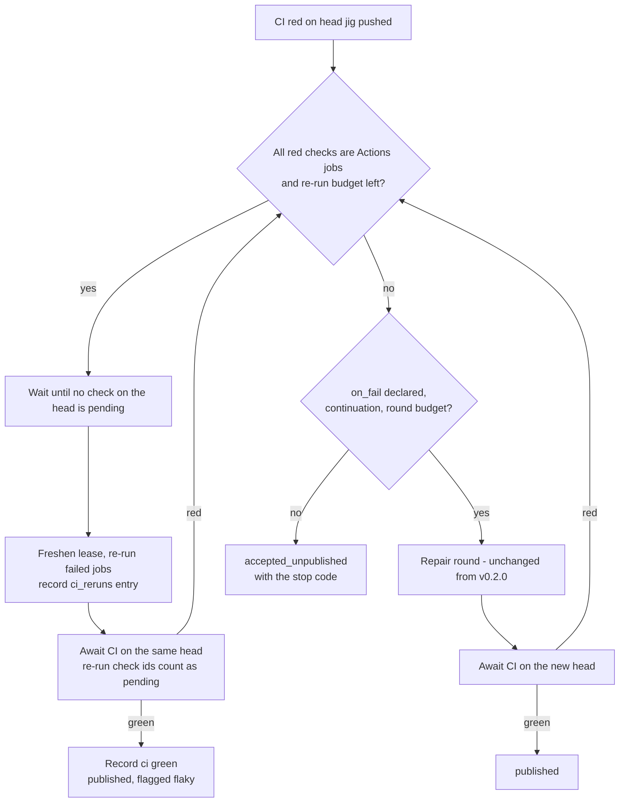

# feat: Measure the factory, re-run flaky CI, parallel reviewers, and close CI repair's test gaps

**Target repo:** `StructuPath/jig`. This follows v0.2.0 (CI repair). `docs/plans/2026-09-27-001-feat-ci-repair-plan.md` is the prior plan and the style reference; its KTDs are cited as `CI:KTDn`, and the v1 plan's (`docs/plans/2026-08-05-001-feat-jig-software-factory-plan.md`) as `V1:KTDn`.

---

## Summary

Six follow-ups to CI repair:
- make the factory **measurable**: record all agent spend, keep publish history across retries, and add a `jig report` over the ledger;
- **re-run flaky CI checks** before spending a repair round;
- run a **read-only reviewer panel in parallel** behind an explicit opt-in;
- **close the two test gaps** CI repair left;
- **decide in writing** to keep repair off the publish-only retry and off `ci_timeout`;
- write a **dogfooding runbook** that uses the report to judge a real trial.

---

## Problem Frame

v0.2.0 made jig repair red CI. Nothing in jig yet says whether that is working: how often a repair round ends green, what an accepted change costs, how much work is held.

Two things stop the ledger from answering today:
- Spend is recorded only when an agent phase succeeds (`internal/engine/phase.go:1146`), so any cost figure undercounts.
- A publish-only retry replaces the attempt's publish summary wholesale (`internal/worker/publish.go:989-998`), which erases the stop code, failed rounds, and any re-runs of exactly the jobs a person had to fix.

The OpenAI factory account this work began from published only velocity. jig has the ledger to publish quality, once those two gaps close.

Three behaviours shipped as known gaps:
- A flaky check burns a repair round or ends `ci_repair_no_change` (CI plan, Scope Boundaries).
- The reviewer panel runs one reviewer at a time, and again in every repair round. It is the slowest part of every factory job.
- Two defensive paths are untested (CI plan, U5 "Known untested").

---

## Requirements

**Measurement**

- R1. Every agent phase exit records the spend of its sends that returned a result, whether the phase passed, failed, died, or hit a terminal bound. Sends whose result was never received (killed) are counted as unmetered, not as zero-cost.
- R2. `jig report` summarizes a time window from the control plane:
  - jobs by terminal state;
  - publish outcomes and held rate;
  - CI repair entry rate, success rate, rounds, and stop codes;
  - flaky re-runs;
  - total spend and spend per clean accept, defined in KTD4.
- R3. The report is read-only, computed server-side behind one GET endpoint, and prints prose by default and the API object with `--json`.
- R4. The report names what jig cannot see. It reports accepts whose green CI was on a head jig did not push, and accepts under definitions that do not wait for CI. It does not claim a post-merge red-CI rate.
- R15. A publish-only retry preserves the publish summaries it replaces, so the report sees every stop code, round, and re-run an attempt went through.

**Flaky CI**

- R5. A definition that waits for CI may declare `publish.ci.rerun: {budget: N}` (1–3). When CI is red on the head jig pushed, jig re-runs the failed GitHub Actions jobs on that same head before any repair round, once their workflow runs have finished. If they then pass, the attempt publishes as green.
- R6. Re-runs never change the branch and are counted separately from repair rounds. Every re-run is recorded in the publish summary. A pass after a re-run is reported as flaky, never as a clean pass.
- R7. Re-runs apply only to Actions jobs. A red non-Actions check skips straight to repair, or ends the attempt as today.

**Parallel reviewers**

- R8. A definition may declare one parallel group: `parallel: [<phase>, …]`, naming two or more consecutive agent phases. Every member's role must have an empty write allowlist, no two members may share an owner role, and no member's `if:` guard may read a field another member reports.
- R9. A group's members run concurrently. Each receives the envelope that preceded the group as its previous envelope. Their results, fields, and gate reports merge in declared order, and the phase after the group receives the last member's envelope. When no member's repair edge triggers, acceptance equals what the same member outputs would produce sequentially. Prompts differ from sequential execution: members do not see each other's envelopes.
- R10. A group's repair edges resolve after the join, walking members in declared order:
  - a member whose edge did not trigger is skipped;
  - a member whose edge triggered with its budget spent applies its exhaustion policy, where `fail-job` ends the attempt and `proceed` moves to the next member;
  - the first member whose edge triggered with budget left dispatches its repair target with its own envelope and charges only its own budget, and the whole group then runs again.

  Total group runs are at most one plus the sum of member budgets.
- R11. Any worktree change during a group is a write-boundary breach, including a change left by a member that died. The attempt aborts and rolls back to the group snapshot.

**Test gaps**

- R12. A stale lease whose attempt is expired but not yet swept is revived by the heartbeat that runs before a publish step or a repair round, and the step proceeds. This is proven with an injected clock.
- R13. Releasing a repair continuation in `jig worker` drains and closes the attempt's trace. This is proven through the real host wiring.

**Trial**

- R14. A runbook takes an operator from preflight to a results table for a dogfooding trial, using `jig report` for every number. Preflight includes runtime auth, `gh` permissions, and the target repository's CI secrets exposure. The trial has a spend ceiling the operator sets.

---

## Key Technical Decisions

- KTD1. **Retry repair and `ci_timeout` repair stay deferred, and this plan is the decision record.**
  - *Retry repair.* It needs a continuation that outlives the process that ran the chain, which means persisting full envelopes and field views: a new confidentiality surface (CI:KTD2). The exit gate showed no case that needed it.
  - *`ci_timeout` repair.* A timeout is CI infrastructure, not code (CI:R2). No gate run timed out.
  - *Revisit when, over a trial:*
    - the `ci_timeout` rate (attempts ending `ci_timeout`, over attempts that waited for CI) exceeds 10%; or
    - the retry-repair signal exceeds 10% of CI-waiting attempts. The signal is attempts whose publish history shows a red stop code followed by a publish-only retry that was still red.

    Both are report outputs (U2), measurable only because R15 keeps the history.
- KTD2. **Record spend on every exit by emitting `agent_end` on every agent phase exit, with an `outcome` and an `unmetered_sends` count.**
  - The report stays one query over one event name.
  - A runtime-error send's usage is added before it returns: the adapter reports cost even when `is_error` is set (`internal/runtime/claudecode/adapter.go:502-507`).
  - A killed send never returns a result, so its cost is unknown and counted as unmetered.
- KTD3. **The report is computed server-side: `Store.Report` behind `GET /api/report`.** Every jig CLI command talks to the API (`cmd/jig/def.go:599`), and the store owns the SQLite schema.
- KTD4. **Report sources and definitions.**
  - *Publish outcomes and history:* the latest attempt per job; its `publish` summary plus `publish_history` (R15).
  - *Pushed rounds:* `publish_ci_repairs`.
  - *Spend:* every attempt of each job in the window.
  - *Spend per clean accept* is total spend over *clean accepts*. A clean accept is a job accepted with green CI on a head jig pushed, or with proof under a definition that does not wait for CI.
  - Held, person-fixed, and failed jobs are reported as their own counts with their own spend. They never inflate the denominator.
  - `publish` may be a plain string (`"not_attempted"`, `"held"`), and oversize results drop `phases` (`internal/worker/publish.go:1003`). The report counts what it cannot read as `unreadable_results`.
- KTD5. **Re-runs are per job, `POST repos/{o}/{r}/actions/jobs/{id}/rerun`, after the failing workflow runs finish.** For Actions the check-run id is the job id (`publish.go:192`).
  - `awaitCI` fails fast on the first red check, but GitHub refuses to re-run a job whose run is still in progress. So the re-run step first waits, within the CI timeout, until no check on the head is pending. A GitHub "in progress" refusal is retried after waiting, not recorded as a spent re-run.
  - The post-re-run CI wait treats a red check whose check-run id was just re-run as pending until a newer check run with the same name appears. Otherwise the stale red result is read back.
  - Re-runs are fenced by the lease (freshen before each request), not by the ledger: they do not move the branch.
  - The summary field is `ci_reruns: [{attempt, jobs, outcome}]`, with `attempt` counting from 1. This name is pinned so the report can land in parallel with U4.
  - Re-run waits run on wall-clock time. Because the engine's ceiling is an absolute deadline from the chain's start, time spent waiting on re-runs is time a later repair round no longer has. The runbook sizes the ceiling for this.
- KTD6. **A parallel group gives each member a private execution view, and keeps attempt-wide counters in the parent.**
  - *Private per member:* session, transcript, results, field delta, gate reports, touched paths, and an ephemeral HOME subdirectory under the attempt's scratch family.
    - Every member's role is seeded into its own HOME serially, before members start. Concurrent Claude Code processes never share `~/.claude.json` or credentials.
    - The continuation's empty-HOME check and `wipeHome` cover every member HOME.
  - *Shared in the parent, safe under concurrency:*
    - the locked emitter;
    - the deadline;
    - an atomic send counter;
    - the session-key sequence and phase-entry counters, made atomic so keys stay unique.
  - *Worktree:* members skip per-phase snapshot, enforcement, and death rollback. The group takes one snapshot before and enforces once after. A member's death re-enters that member alone, after siblings finish.
  - *Terminal exits:* a group-scoped stop signal is selected by every member send and kills its subprocess. On the first attempt-terminal member result, the runner stops the siblings and waits for them, runs the single enforcement, then ends the attempt. The cause is chosen by precedence: breach, cancellation, ceiling, send budget, then member order. Partial member views are discarded.
  - *Process groups:* the worker manifest records the set of live process groups per attempt (`internal/worker/manifest.go`, `registration.go`), so start-time reconciliation stops every orphaned member after a crash.
- KTD7. **`factory.yaml` does not opt into the parallel panel in this plan.** R10 changes review semantics: one rejection re-runs the whole panel, and earlier approvers are re-judged. That should be observed in the dogfooding trial before it becomes the stock default. A new example definition exercises the construct.
- KTD8. **A trial spend ceiling is an operator practice using `jig report`, not a new enforcement mechanism.** Per-send `budget_usd` already bounds any single send. The runbook makes checking the ceiling a step before each job batch.

---

## High-Level Technical Design

**Publish after CI goes red, with both policies declared**



The re-run budget is per attempt, not per head. After a repair round pushes a new head, re-runs apply to it only within what is left.

**A parallel reviewer group inside the chain**

```mermaid
sequenceDiagram
    participant C as runChain
    participant G as group runner
    participant M1 as member A (own view, own HOME)
    participant M2 as member B (own view, own HOME)
    C->>G: parallel [review-security, review-maintainability], previous = pre-group envelope
    G->>G: snapshot worktree once; seed each member HOME serially
    par
        G->>M1: run phase (previous = pre-group envelope)
    and
        G->>M2: run phase (previous = pre-group envelope)
    end
    Note over G,M2: any terminal member result: stop siblings, wait, then enforce
    M1-->>G: view (results, fields, gates, touched)
    M2-->>G: view
    G->>G: enforce boundary once (any change = breach)
    G->>C: merge in declared order; next phase gets member B's envelope
    C->>C: walk edges in declared order (R10); dispatch at most one repair, then rerun the group
```

---

## Implementation Units

### U1. Record spend on every agent phase exit

- **Goal:** `agent_end` carries cost on every exit path, with an `outcome` and an `unmetered_sends` count.
- **Requirements:** R1
- **Dependencies:** none
- **Files:** `internal/engine/phase.go`, `internal/engine/phase_test.go`, `internal/runtime/claudecode/adapter.go` (only if the semantics check below requires it)
- **Approach:**
  - Emit `agent_end` from every exit of `runAgentPhaseAttempt`: success, fail, death, send budget, ceiling, and cancellation.
  - In `send`, add a runtime-error result's usage to spend before returning (KTD2).
  - Count each killed send as unmetered.
  - Verify whether Claude Code's `total_cost_usd` is per invocation or cumulative across `--resume` sends. The `+=` at `phase.go:1321` is only correct for per-invocation. Verify with one real `haiku` resume, then fix the accumulation if it is cumulative.
- **Patterns to follow:** the existing `agent_end` payload at `phase.go:1146`; the event-sequence test's exact-sequence style.
- **Test scenarios:**
  - A phase that parses and passes emits one `agent_end` with `outcome: passed`, cost equal to the scripted usage, and zero unmetered sends.
  - A phase whose envelope is `status: fail` emits `agent_end` with `outcome: failed` and its cost.
  - A send that ends as a runtime error contributes its reported usage.
  - A phase that dies (crash step) and re-enters emits an `agent_end` per entry. The dead entry reports its killed send as unmetered.
  - A send-budget exhaustion and a ceiling hit each emit `agent_end` before the terminal event.
  - The exact-sequence test is updated for the new events, and still pins order.
- **Verification:** summing `agent_end.cost` over a scripted attempt equals the sum of usage over sends that returned a result. Summing `unmetered_sends` equals the number of killed sends.

### U8. Keep publish history across retries

- **Goal:** R15.
- **Requirements:** R15
- **Dependencies:** none
- **Files:** `internal/worker/publish.go` (`withPublishSummary`), `internal/worker/publish_ci_test.go`
- **Approach:** When `withPublishSummary` replaces a `publish` value that is already a summary object, append the old object to a `publish_history` array first. Keep at most the last 5 entries, and keep the result within `protocol.MaxResultBytes` by dropping the oldest history entries before degrading anything else. First publishes, whose prior value is the string `"not_attempted"`, add no history.
- **Patterns to follow:** the size-bounded result handling in `withPublishSummary` and `summaryJSON`.
- **Test scenarios:**
  - A red attempt that is publish-retried to green has `publish` green and one `publish_history` entry carrying the original `ci_failed` code and failures.
  - An attempt exhausted by repair rounds and then retried keeps its `ci_repairs` and stop code in history.
  - Six retries keep only the last five history entries.
  - A history large enough to breach the result cap drops the oldest entries first.
  - A first publish adds no history.
- **Verification:** the report tests (U2) read stop codes from history.

### U2. `Store.Report` and `GET /api/report`

- **Goal:** one read-only aggregate over a window.
- **Requirements:** R2, R3, R4, R6, R15
- **Dependencies:** none. It reads U8's `publish_history` and U4's pinned `ci_reruns` name, and tolerates their absence.
- **Files:** `internal/controlplane/report.go`, `internal/controlplane/report_test.go`, `internal/controlplane/http.go` (route registration)
- **Approach:**
  - Window by job `updated_at` for terminal jobs. Sources and definitions follow KTD4.
  - Spend comes from summing `agent_end` cost and `unmetered_sends` in `events` via `json_extract(CAST(payload AS TEXT), '$.payload.…')`.
  - A repair stop code, re-run, or round counts once per attempt, across `publish` and `publish_history`.
  - Report KTD1's two revisit rates.
- **Patterns to follow:** read handlers in `internal/controlplane/ingest.go` (`queryInt` for parameters); store read methods such as `AttemptCIRepairs` in `ci_repair_ledger.go`.
- **Test scenarios:**
  - Seeded jobs across every terminal state produce exact counts. Jobs outside the window are excluded.
  - An attempt with two pushed rounds that ended green counts as repaired, successful, 2 rounds.
  - An attempt ending `ci_repair_exhausted` and later publish-retried to green still counts as repaired, unsuccessful, with its stop code, read from history.
  - Held, not-attempted, and string-shaped `publish` values are each classified. A malformed result increments `unreadable_results`.
  - A green `ci` on a person's head counts as a person-fixed accept, not a clean accept.
  - Spend sums every attempt of a job. Spend per clean accept excludes held and person-fixed jobs from the denominator, and reports their spend separately.
  - `unmetered_sends` totals are reported alongside spend.
  - A result carrying `ci_reruns` with a pass after a re-run counts as flaky.
  - The `ci_timeout` rate and retry-repair signal (KTD1) compute from seeded data.
  - The empty window returns zeros, not an error. A bad `since` returns 400.
- **Verification:** the handler returns the object the tests assert, over one read-only path with no migration.

### U3. `jig report` CLI

- **Goal:** operator surface for U2.
- **Requirements:** R3
- **Dependencies:** U2
- **Files:** `cmd/jig/report.go`, `cmd/jig/report_test.go`, `cmd/jig/main.go` (dispatch and usage), `README.md`
- **Approach:** `jig report [--server] [--since 7d|<RFC3339>] [--until …] [--json]`. It follows the `defFlags` / `apiCall` / `emitJSON` conventions and exit codes 0/1/2 (`cmd/jig/def.go`). The prose output is a short table per section, and states the R4 caveat and the unmetered-send count in one line each.
- **Patterns to follow:** `cmd/jig/def.go` read commands; `startServe` in `cmd/jig/serve_test.go`.
- **Test scenarios:**
  - Against a live `jig serve` with seeded data, prose output names each section and both caveat lines.
  - `--json` prints the API object verbatim.
  - `--since` accepts durations and RFC3339. An unparseable value exits 2 with usage.
  - An unreachable server exits 1.
- **Verification:** `jig report` against the test server matches `GET /api/report`.

### U4. Declared re-runs for flaky Actions checks

- **Goal:** R5–R7 in the publishing runner and the repair loop.
- **Requirements:** R5, R6, R7
- **Dependencies:** none
- **Files:**
  - `internal/protocol/definition.go`, `internal/protocol/definition_test.go`
  - `internal/worker/publish.go` (gateway method, `PullRequestGateway`, `ciPolicy`, `awaitCI` pending-override, hook in `PublishingRunner.Run`)
  - `internal/worker/publish_repair.go`, `internal/worker/publish_repair_test.go` (re-runs between rounds)
  - `internal/worker/publish_rerun_test.go`
  - `internal/worker/publish_test.go` (`fakeGateway`), `cmd/jig/ci_repair_test.go` (`e2eGateway`)
  - `examples/definitions/factory.yaml` (opt in with `budget: 1`), `README.md`
- **Approach:**
  - Add `CISpec.Rerun{Budget}`, valid only with `wait`, budget 1–3.
  - Add a gateway method `RerunFailedJobs` that POSTs per Actions job id (KTD5).
  - A re-run step waits until no check on the head is pending, freshens the lease, re-runs, records a `ci_reruns` entry, and runs a fresh `ci` wait that treats the re-run check-run ids as pending until they are replaced.
  - The step runs:
    - in `PublishingRunner.Run` on `ci_failed`, when the policy is declared, budget remains, and every red check is an Actions job;
    - inside `repairCI`'s loop, before each next round.
  - Whether the step lives in `publish_repair.go` or its own file is an implementation choice.
  - Add a gated real-`gh` test, skipped unless `JIG_RERUN_GATE` names a scratch repository. Its workflow must have a slow sibling job, because both CI repair gate bugs were invisible to the fakes.
- **Patterns to follow:** `repairCI` in `internal/worker/publish_repair.go` (loop shape, summary entries, `failSummary`); `FailedCheckLogs` (per-check gating); `TestMilestone2ExitGate` (env-gated real test).
- **Test scenarios:**
  - A single red Actions check that passes on re-run publishes green. `ci_reruns` has one entry, outcome `passed`, and no repair round runs.
  - A sibling job still pending when the first check goes red delays the re-run until the sibling finishes.
  - The first poll after a re-run returns the stale failed check. It is treated as pending, not as red.
  - A GitHub "in progress" refusal is retried after waiting and does not spend the budget. Any other refusal is recorded with its diagnostic and falls through to repair or stop.
  - A check still red after the budget, with `on_fail` declared, goes on to a repair round. Without `on_fail`, it ends `ci_failed` with the re-runs recorded.
  - Any red non-Actions check skips re-runs entirely.
  - After a repair round pushes a new red head, the remaining re-run budget applies to it. A spent budget does not.
  - A lost lease before a re-run means no re-run request is sent.
  - Validation rejects `rerun` without `wait`, and budgets 0 or 4.
- **Verification:** worker tests green. The gated real test, when run, re-runs a job through real `gh` after its slow sibling finishes.

### U5. A parallel read-only reviewer group

- **Goal:** R8–R11 in the engine, behind an explicit construct.
- **Requirements:** R8, R9, R10, R11
- **Dependencies:** none
- **Files:**
  - `internal/protocol/definition.go`, `internal/protocol/definition_test.go`
  - `internal/engine/phase.go`, new `internal/engine/parallel.go`, new `internal/engine/parallel_test.go`
  - `internal/engine/enginetest/runtime.go` (concurrency-safe scripted runtime)
  - `internal/worker/manifest.go`, `internal/worker/registration.go`, `internal/worker/reconcile_test.go` (process-group set)
  - new `examples/definitions/factory-parallel.yaml`, `README.md`
- **Approach:**
  - Add a top-level definition field `parallel: [a, b, c]`: one group per definition, validated per R8.
  - `runChain` runs the group as one step through a group runner, following KTD6 and the R9/R10 contract.
  - Repair rounds (`RepairCI`) use the same group runner when the group follows `run`.
- **Execution note:** Start test-first with the R9 merge contract: grouped and ungrouped runs of prompt-independent scripted reviewers produce identical merged results, field view, gate reports, and acceptance, and each member's recorded prompt carries the pre-group envelope. Then build the runner until it holds.
- **Patterns to follow:** `runPhaseWithEdge` and `runChain` in `internal/engine/phase.go`; `internal/engine/resume.go` for carrying state across a sub-run; the emitter lock in `internal/engine/events.go`.
- **Test scenarios:**
  - Covers R9: grouped and ungrouped runs of three approving reviewers merge identically. Each member's prompt carries the pre-group envelope, and the next phase's prompt carries the last member's envelope.
  - Members run concurrently: two scripted reviewers that each block until the other starts both complete, where sequential execution would deadlock (bounded by a test timeout).
  - Covers R10:
    - two members reject, and only the first in declared order dispatches `build`, the whole group re-runs, and only its budget is charged;
    - the first member triggers with its budget spent under `proceed`, so the second member dispatches;
    - the first member triggers with its budget spent under `fail-job`, so the attempt ends.
  - Covers R11: a member that writes a file triggers a breach, abort, and rollback to the group snapshot, with no partial merge. A dying member that left a write also triggers a breach.
  - A member death re-enters only that member after siblings finish, and siblings' results are kept.
  - A member hitting the send budget stops a sibling that is mid-send, which is waited for. Enforcement runs, and the attempt ends with the send-budget cause, never overshooting.
  - Session keys are unique across members, and `seq` stays strictly increasing and unique while events interleave.
  - Each member runs in its own seeded HOME, and all member HOMEs are wiped when the chain ends.
  - The worker manifest records both members' process groups, and reconciliation after a simulated crash stops both.
  - Validation rejects:
    - a writing member;
    - a code-phase member;
    - two members sharing a role;
    - non-consecutive members;
    - a member guarded on a sibling's reported field;
    - a second group.
  - `factory-parallel.yaml` validates. Its three reviewers are grouped.
- **Verification:** all scenarios pass under `-race`.

### U6. Close CI repair's two test gaps

- **Goal:** R12 and R13 proven.
- **Requirements:** R12, R13
- **Dependencies:** none
- **Files:** `internal/worker/publish_repair_test.go` or `internal/worker/publish_test.go`, `cmd/jig/ci_repair_test.go`
- **Approach:**
  - The lease test sets `lease.now` to a time past `HeartbeatInterval`, which makes `freshen` treat the lease as stale, and expires the lease server-side (`expireLease`). A repair round's authorization must then succeed via the heartbeat. The same scenario with a fresh clock must fail, which proves the heartbeat did the work.
  - For the trace, assert through the real `workerAttemptRunner` wiring that, after the attempt returns, the control plane holds every event in the attempt's JSONL raw record. The drain must be deterministic, not timing-based (see Open Questions).
- **Patterns to follow:** `expireLease` in `internal/worker/publish_test.go`; `cmd/jig/ci_repair_test.go`.
- **Test scenarios:**
  - Covers R12: stale local clock plus server-expired lease → heartbeat revives → the round is authorized and recorded.
  - Same, but the fresh local clock skips the heartbeat → `lease_not_owner`.
  - A superseded lease (a successor exists) is not revived.
  - Covers R13: after a repaired attempt, control-plane events equal JSONL lines. Removing the `closeTrace` call from the host cleanup makes the test fail.
- **Verification:** both mutants (no `freshen`; no `closeTrace`) fail their tests.

### U7. Dogfooding runbook

- **Goal:** R14.
- **Requirements:** R14
- **Dependencies:** U2, U3 (the runbook's numbers come from `jig report`); U4 optional
- **Files:** new `docs/dogfooding.md`, `README.md` (link)
- **Approach:**
  - **Preflight:**
    - runtime auth works in an ephemeral HOME (a one-send smoke run);
    - `gh auth status` has `repo` and `workflow` scopes, and the token can re-run Actions jobs;
    - the target repository's CI is green on `main`;
    - its Actions secrets are ones the operator accepts being re-run and exercised unattended.
  - **Trial protocol:**
    - job selection;
    - the ceiling check before each batch (KTD8);
    - an attempt ceiling sized for the chain, plus CI waits for the declared re-runs and rounds (KTD5);
    - what to record per job.
  - **Exit table:** a template filled from `jig report --json`.
  - **Decision thresholds:** KTD1's revisit rates, and a flaky-re-run rate that suggests masking.
  - **Lessons from the CI repair exit gate:** real-`gh` checks, keychain auth, and keeping CI inputs out of logs.
- **Test expectation:** none — documentation. Its commands are the ones U3's tests exercise.
- **Verification:** a reader can run preflight and one job end to end from the doc alone.

---

## Sequencing

| Wave | Units | Why |
|---|---|---|
| 1 (parallel) | U1, U2, U4, U5, U6, U8 | Independent. U2 reads U4's and U8's pinned field names, not their code. |
| 2 | U3 | Needs U2's endpoint. |
| 3 | U7 | Its numbers come from U3. |

Each unit lands as its own PR against `main`, never stacked. The CI repair series lost two merges to stacked bases. Overlapping files resolve by rebase in merge order:
- U1 and U5 both touch `internal/engine/phase.go`, in different functions.
- U4 and U5 both touch `internal/protocol/definition.go` and `README.md`.
- U4 and U8 both touch `internal/worker/publish.go`.

---

## Scope Boundaries

**Deferred to follow-up work**
- A UI panel for the report. The CLI and API come first; the panel reads the same endpoint.
- Opting `factory.yaml` into the parallel panel (KTD7).
- More than one parallel group per definition, until a second real consumer exists.
- Repair on publish-only retry, and `ci_timeout` repair (KTD1, with the revisit thresholds).
- A true post-merge red-CI metric. It needs a new watcher of the base branch after merge (R4).
- A cross-job spend ceiling enforced by jig (KTD8).

**Outside this plan**
- Running the live dogfooding trial. It needs a target repository and a spend ceiling from the operator. The runbook is the deliverable.

---

## Risks & Dependencies

| Risk | Mitigation |
|---|---|
| A parallel group corrupts shared engine state in ways tests miss | KTD6 isolates member state, including HOME, instead of locking it; every U5 scenario runs under `-race` |
| Concurrent reviewers and gates collide in the worktree (git `index.lock`) | Members are read-only. Command gates on members run after the join is a possible fallback if tests show collisions |
| Re-runs mask real flakiness | Every re-run is recorded; a pass after a re-run is reported as flaky (R6); the runbook sets a masking threshold |
| A re-run path fails on real `gh` the way log reads did | A gated real-`gh` test with a slow sibling job (U4) |
| `total_cost_usd` is cumulative across resume, so today's totals are inflated | U1 verifies with a real resume before the report depends on it |
| Report queries slow down as `events` grows | One query per report, filtered by window; an index on `events(type)` is added only if a test on realistic volume shows need |
| Merge conflicts between wave-1 units | Different functions in shared files; rebase in merge order |

---

## Open Questions

- **Deferred to implementation:** how U6 makes the trace drain deterministic. The options are the stream's own close-and-drain signal, or a test flush interval. Whichever is chosen, the assertion must not rely on timing.
- **Deferred to implementation:** whether `total_cost_usd` is cumulative (U1 decides with a real run).

---

## Sources & Research

- Spend today: `internal/engine/phase.go:1146` (only on success); `:1005-1063` (paths that skip it); `:1318-1321` (accumulation); `internal/runtime/claudecode/adapter.go:502-507` (cost reported on error results).
- Result shape and retry overwrite: `internal/engine/phase.go:388-410`; `internal/worker/publish.go:117-132,989-1008,1066-1070`; `internal/worker/publish_repair.go:29-54`.
- Engine shared state: `internal/engine/phase.go:232-270` (execution), `:699` (phase entries), `:1372-1390` (sessions), `:1398-1405` (HOME seeding); write boundary in `internal/engine/boundary.go`.
- Process-group manifest: `internal/worker/registration.go:185-191`; `internal/worker/manifest.go:446-452`.
- CI wait fail-fast: `internal/worker/publish.go:731-790`. Actions job id as check-run id: `:192-195`.
- CLI conventions: `cmd/jig/main.go:24-72`; `cmd/jig/def.go:7-10,55-59,576-599`.
- Lease clock: `internal/worker/claiming.go:34-88`.
- CI repair exit gate lessons: `docs/plans/2026-09-27-001-feat-ci-repair-plan.md`, section "Exit gate".
